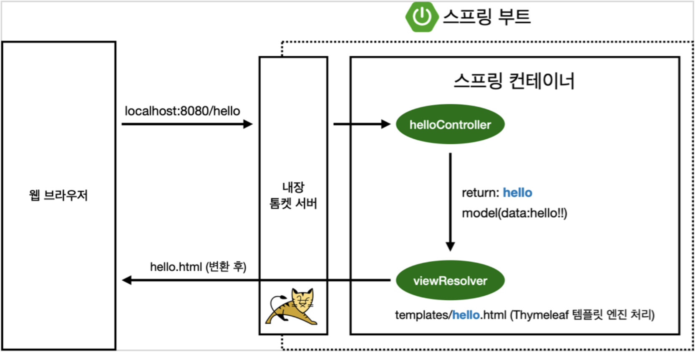
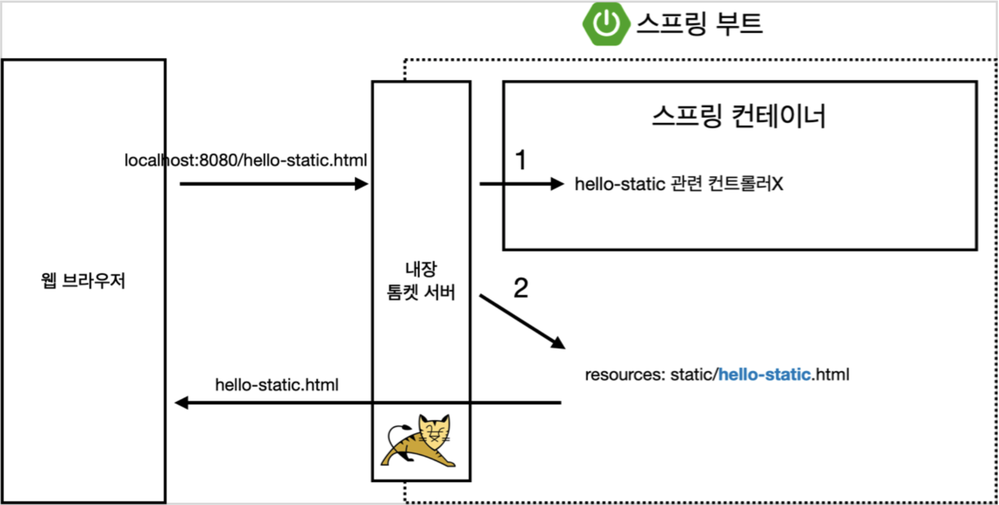
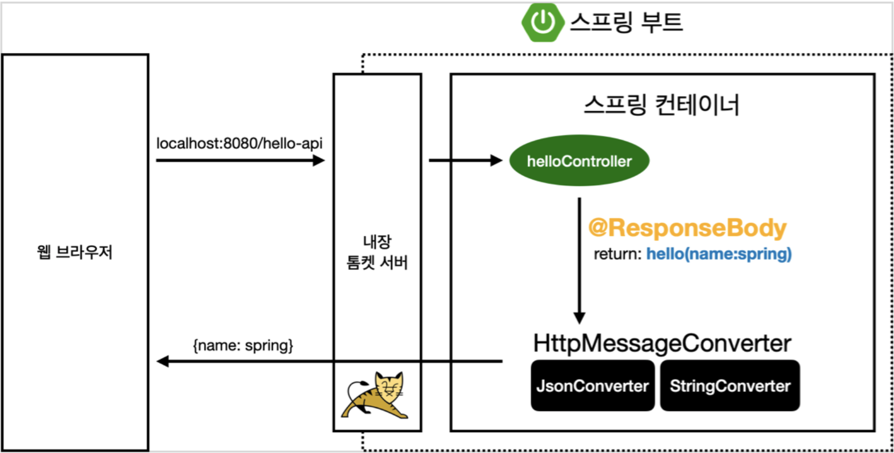

# SpringBootTutorial

이 프로젝트는 인프런 강의 "김영한의 스프링 입문
코드로 배우는 스프링 부트, 웹 MVC, DB 접근 기술"을 토대로 만들어졌습니다.

## 1. 프로젝트 생성

- 준비물 및 도구
    - Java 11
    - IntelliJ IDEA CE
    - Gradle

- 스프링 부트 스타터 사이트에서 프로젝트 생성

    [https://start.spring.io](https://start.spring.io/)

    - Project → Gradle
    - Spring Boot → 2.3.x
    - Language → Java
    - Packaging → jar
    - groupId → com.example
    - artifactId → spring-boot-tutorial
    - dependencies
        - Spring-Web
        - Tyhmeleaf (HTML 탬플릿 엔진)

- IntelliJ IDEA의 build and run을 Gradle에서 IntelliJ IDEA로 바꾸기
    - IntelliJ IDEA가 최신 버전에서 Gradle을 default 실행자로 사용하는데 IDEA 보다 실행 속도가 느림

    - Preferences → Build, Execution, Deployment → Build Tools → Gradle
        - Build and run using: Gradle → IntelliJ IDEA
        - Run tests using: Gradle → IntelliJ IDEA

- 동작 확인

    Spring Boot Application 클래스 실행 후, [localhost](http://localhost):8080 들어가서 에러페이지 확인

## 2. 라이브러리 살펴보기

Gradle은 의존관계가 있는 라이브러리를 함께 다운로드 한다.

→ 첫 프로젝트 생성 시 의존성을 Spring-Web, Thymeleaf 2가지만 설정했어도, Spring 애플리케이션에 동작하기 위한 의존 관계의 라이브러리가 함께 다운로드 된다.

- 스프링 부트 라이브러리
    - spring-boot-starter-web
        - spring-boot-starter-tomcat: 톰캣 내장 웹서버
        - spring-webmvc: 스프링 웹 MVC
    - spring-boot-starter-thymeleaf: HTML 템플릿 엔진(View)
    - spring-boot-starter (공통 의존 관계)
        - spring-boot
            - spring-core
        - spring-boot-starter-logging (실제 현업에서 로그 남기는 것에 관련된 라이브러리)
            - logback, slf4j
- 테스트 라이브러리
    - spring-boot-starter-test
        - junit: 테스트 프레임워크
        - mockito: 모킹 라이브러리
        - assertj: 테스트 코드 작성을 좀 더 편하게 도와주는 라이브러리
        - spring-test: 스프링 통합 테스트 지원

### Spring boot 메뉴얼과 튜토리얼 참고하기

- 스프링 공식 튜토리얼: [https://spring.io/guides/gs/serving-web-content/](https://spring.io/guides/gs/serving-web-content/)
- 스프링 부트 메뉴얼: [https://spring.io/projects/spring-boot#learn](https://spring.io/projects/spring-boot#learn)

## 3. Welcome Page 만들기

- Spring boot의 Welcome Page

    resources:static/index.html 파일이 웰컴 페이지 역할을 수행

    ```jsx
    <!DOCTYPE HTML>
      <html>
      <head>
          <title>Hello</title>
    <meta http-equiv="Content-Type" content="text/html; charset=UTF-8" /> </head>
      <body>
      Hello
      <a href="/hello">hello</a>
      </body>
      </html>
    ```

- thymeleaf 템플릿 엔진

    html을 베이스로 하되, for loop와 같은 기능을 통해 html 파일을 생성할 수 있도록 해줌

- Hello Page
    - Hello Controller

    ```jsx
    @Controller
    public class HelloController {

    	@GetMapping("hello") // [GET]http://host/hello 으로 맵핑
    	public String hello(Model model) {
    		model.addAttribute("data", "hello"); // data 애트리뷰트의 값은 hello
    		return "hello"; // resources:templates/hello.html 파일을 렌더링
    	}
    }
    ```

    - hello.html

    ${변수명} 은 렌더링 해주는 Controller에서 addAttribute 메소드를 통해 모델에 설정된 속성 값

    ```jsx
    <!DOCTYPE HTML>
    <html xmlns:th="http://www.thymeleaf.org"> <head>
          <title>Hello</title>
    <meta http-equiv="Content-Type" content="text/html; charset=UTF-8" /> </head>
    <body>
    <p th:text="'안녕하세요. ' + ${data}">
    	안녕하세요. 손님
    </p>
    </body>
    </html>
    ```

    - thymeleaf 템플릿 엔진 동작 확인

        실행: http://localhost:8080/hello

        [동작 환경 그림]

        

        - Controller의 return String → viewResolver 가 화면을 랜더링
            - 스프링 부트에서 기본적인 탬플릿 엔진의 View Name 맵핑 구조

                return {viewName:String};

                → `resources:templates/`{viewName}`.html`

### Spring Boot Devtools

- 스프링 부트 앱의 재시작 없이 html 리컴파일로 View 변경사항의 실시간 적용을 가능하게 하는 라이브러리
    - IntelliJ IDEA에서 html 리컴파일: 메뉴 → build → Recompile


## 4. 빌드 및 실행

터미널에서 다음의 명령어를 실행

```jsx
// 프로젝트의 루트 폴더에 위치한다고 가정
// 프로젝트 빌드
./gradlew build

// 빌드된 jar 파일이 있는 곳으로 이동
cd ./build/libs

// java로 빌드된 jar파일 실행
java -jar 프로젝트이름-x.x.x-SNAPSHOT.jar //빌드에 따른 버전 다름
```

빌드 클리닝

```jsx
// build 폴더 지우기
./gradlew clean

// build 폴더 싹 지운 후, 다시 빌드
./gradlew clean build
```

## 5. 스프링 웹 개발 기초

### 정적 컨텐츠

스프링 부트 컨트롤러에서 별도의 조작이 없으며, 클라이언트로부터 리퀘스트가 오자마자 바뀌지 않는 정적 자원(파일)을 클라이언트로 즉시 반환해주는 서버 리스폰스 형식

`resources:static/` 밑에 파일을 위치시키면, 스프링 부트에서는 각 파일의 이름으로 정적컨텐츠를 인식

- `resources:static/hello-static.html`

```jsx
<!DOCTYPE HTML>
  <html>
  <head>
      <title>static content</title>
<meta http-equiv="Content-Type" content="text/html; charset=UTF-8" /> </head>
<body>
정적 컨텐츠 입니다.
  </body>
</html>

```

실행: http://localhost:8080/hello-static.html

[정적 컨텐츠 동작 원리]



- 클라이언트로 부터 요청이 올 때,
    1. 먼저, 스프링 부트에 해당 요청을 처리하는 컨트롤러가 있는지 검사
    2. 없다면 static 폴더 내부의 정적 컨텐츠를 확인하여 클라이언트 리스폰스로 보내줌

### MVC와 템플릿 엔진

- MVC?

    Model, View, Controller라는 컴포넌트를 정의하는 소프트웨어 디자인 패턴의 약칭

    

- Model

    애플리케이션의 정보 및 데이터를 나타내는 컴포넌트

    데이터베이스, 상수, 초기값, 변수 등 애플리케이션을 구성하는 모든 데이터를 포함

    또는 그 데이터들의 가공 담당

    Model의 규칙

    1. 사용자가 변경하려는 모든 데이터를 포함할 것
    2. View, Controller의 어떤 정보도 모르며, 독립되어 있을 것

        모델은 재사용이 가능하고, 다른 인터페이스에 영향을 받으면 안됨

    3. 데이터의 변경 시, 변경을 적용하는 처리방법을 구현할 것

        변경이 발생하면 이벤트를 발생시키거나, 수신할 수 있는 방법이 구현되어야 함

- View

    애플리케이션의 정보와 데이터를 사용자가 볼 수 있도록 출력하는 컴포넌트

    View의 규칙

    1. 모델이 가지고 있는 정보를 별도로 저장하지 말 것

        모델로부터 전달받은 정보를 유지하기 위해, 임의로 뷰 내부에 저장해선 안된다

    2. Model, Controller의 어떤 정보도 모르며, 독립되어 있을 것

        다른 컴포넌트가 어떻게 동작하는지 알아서는 안된다.

        전달받은 데이터를 출력만하는 수동적인 역할만을 수행할 것

        또, 재사용이 가능하고, 정보의 표현에 있어 쉽도록 설계 되어야 함

    3. 데이터의 변경 시, 변경을 적용하는 처리방법을 구현할 것

        사용자가 출력된 내용의 변경을 시도할 때, 이벤트를 모델로 전달할 수 있어야 한다.

- Controller

    데이터와 사용자 인터페이스 요소들을 잇는 다리 역할을 하는 컴포넌트

    사용자가 데이터를 조작하는 것에 대한 이벤트들을 처리

    Controller의 규칙

    1. 서로의 존재를 모르는 모델과 뷰의 중재를 위해, 컨트롤러는 모델과 뷰의 존재를 숙지할 것

        모델과 뷰는 데이터 변경 이벤트를 외부로 알리거나, 외부에서 수신하는 방법만 가짐

    2. 모델과 뷰의 변경 이벤트를 해석해서 각자 목표 컴포넌트로 전달해줄 것

        또, 애플리케이션의 메인 로직은 컨트롤러가 담당하게 된다.

- Hello MVC
    - HelloController

        hello-mvc의 GET 맵핑 추가

        ```jsx
        @Controller
        public class HelloController {
        		// 기존 맵핑 [GET] hello
            @GetMapping("hello")
            public String hello(Model model) {
                model.addAttribute("data", "hello");
                return "hello"; // resources:templates/hello.html
            }

        		// 추가 맵핑 [GET] hello-mvc
            @GetMapping("hello-mvc")
            public String helloMVC(@RequestParam("name") String name, Model model) {
                model.addAttribute("name", name);
                return "hello-template";
            }
        }
        ```

        @RequestParam : 해당 맵핑에 리퀘스트 패러매터를 설정해줌

        (default required 값은 true → 즉, 파라매터를 안넘겨주면 오류가 발생하게 됨)

    - hello-template.html

        ```jsx
        <html xmlns:th="http://www.thymeleaf.org"> <body>
        <p th:text="'hello ' + ${name}">hello! empty</p> </body>
        </html>
        ```

        타임리프 탬플릿 엔진을 이용하는 템플릿 파일

        → name이라는 키의 값을 컨트롤러에서 받아오지 못하면 default로 설정된 "hello! empty"가 출력됨

    - 동작 확인

        http://localhost:8080/hello-mvc?name=spring
    
    ### API
    
    MVC 패턴의 컨트롤러처럼 템플릿 엔진을 통해서 렌더링된 HTML을 리스폰스로 전달하지 않고,
    
    스트링이나 객체를 시리얼라이징하여 HTML 바디에 내용을 직접 반환하는 형식
    
    기존 MVC 패턴에서 렌더링 HTML 뷰를 반환하는 컨트롤러와 다르게
    
    추가적인 애노테이션 `@ResponseBody` 이 요구된다
    
    - Hello String
        - Hello Controller
    
            [GET] hello-string 맵핑 추가
    
            ```jsx
            @GetMapping("hello-string")
            @ResponseBody
            public String helloString(@RequestParam("name") String name) {
            	return "hello " + name;
            }
            ```
    
            `@ResponseBody` 애노테이션 때문에, 템플릿 엔진으로 렌더링 된 HTML 대신에 단순한 스트링이 반환
    
        - 실행
    
            http://localhost:8080/hello-string?name=spring
    
    - Hello API
        - Hello Controller
    
            [GET] hello-api 맵핑과 반환하려는 객체 Hello 추가
    
            ```jsx
            // 시리얼라이징을 통해 HTTP 바디로 변환될 객체 Hello
            static class Hello {
            	private String name;
    
            	public String getName() {
            		return name;
            	}
    
            	public void setName(String name) {
            		this.name = name;
            	}
            }
    
            @GetMapping("hello-api")
            @ResponseBody
            public Hello helloAPI(@RequestParam("name") String name) {
            	Hello hello = new Hello();
            	hello.setName(name);
            	return hello;
            }
            ```
    
            `@ResponseBody` 애노테이션 때문에, Hello 객체는 JSON으로 시리얼라이징되어 반환
    
        - 실행
    
            http://localhost:8080/hello-api?name=spring
    
    [ResponseBody 동작 원리]
    
    
    
    컨트롤러에서 `ResponseBody` 애노테이션을 사용하면
    
    - HTTP 바디에 return 데이터를 직접 반환
    - `viewResolver` 대신에 `HttpMessageConverter`가 컨트롤러의 return 데이터를 처리
    
    return 데이터 타입에 스프링에서 기본으로 채택하고 있는 라이브러리
    
    - String: `StringHttpMessageConverter`
    - Object: `MappingJackson2HttpMessageConverter`
    
        객체는 기본적으로 JSON 데이터로 반환됨 (XML로 바꿀 수도 있으나 현재는 찾아보기 힘든 추세)
    
        - Java 객체를 JSON 형식으로 시리얼라이징하는 라이브러리 중 대표 라이브러리
            - Gson
            - Jackson
