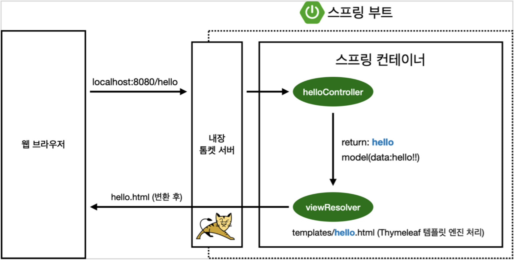

# SpringTutorial

## 1. 프로젝트 생성

- 준비물 및 도구
    - Java 11
    - IntelliJ IDEA CE
    - Gradle

- 스프링 부트 스타터 사이트에서 프로젝트 생성

    [https://start.spring.io](https://start.spring.io/)

    - Project → Gradle
    - Spring Boot → 2.3.x
    - Language → Java
    - Packaging → jar
    - groupId → com.example
    - artifactId → spring-tutorial
    - dependencies
        - Spring-Web
        - Tyhmeleaf (HTML 탬플릿 엔진)

- IntelliJ IDEA의 build and run을 Gradle에서 IntelliJ IDEA로 바꾸기
    - IntelliJ IDEA가 최신 버전에서 Gradle을 default 실행자로 사용하는데 IDEA 보다 실행 속도가 느림

    - Preferences → Build, Execution, Deployment → Build Tools → Gradle
        - Build and run using: Gradle → IntelliJ IDEA
        - Run tests using: Gradle → IntelliJ IDEA

- 동작 확인

    Spring Boot Application 클래스 실행 후, [localhost](http://localhost):8080 들어가서 에러페이지 확인

## 2. 라이브러리 살펴보기

Gradle은 의존관계가 있는 라이브러리를 함께 다운로드 한다.

→ 첫 프로젝트 생성 시 의존성을 Spring-Web, Thymeleaf 2가지만 설정했어도, Spring 애플리케이션에 동작하기 위한 의존 관계의 라이브러리가 함께 다운로드 된다.

- 스프링 부트 라이브러리
    - spring-boot-starter-web
        - spring-boot-starter-tomcat: 톰캣 내장 웹서버
        - spring-webmvc: 스프링 웹 MVC
    - spring-boot-starter-thymeleaf: HTML 템플릿 엔진(View)
    - spring-boot-starter (공통 의존 관계)
        - spring-boot
            - spring-core
        - spring-boot-starter-logging (실제 현업에서 로그 남기는 것에 관련된 라이브러리)
            - logback, slf4j
- 테스트 라이브러리
    - spring-boot-starter-test
        - junit: 테스트 프레임워크
        - mockito: 모킹 라이브러리
        - assertj: 테스트 코드 작성을 좀 더 편하게 도와주는 라이브러리
        - spring-test: 스프링 통합 테스트 지원

### Spring boot 메뉴얼과 튜토리얼 참고하기

- 스프링 공식 튜토리얼: [https://spring.io/guides/gs/serving-web-content/](https://spring.io/guides/gs/serving-web-content/)
- 스프링 부트 메뉴얼: [https://spring.io/projects/spring-boot#learn](https://spring.io/projects/spring-boot#learn)

## 3. Welcome Page 만들기

- Spring boot의 Welcome Page

    resources:static/index.html 파일이 웰컴 페이지 역할을 수행

    ```jsx
    <!DOCTYPE HTML>
      <html>
      <head>
          <title>Hello</title>
    <meta http-equiv="Content-Type" content="text/html; charset=UTF-8" /> </head>
      <body>
      Hello
      <a href="/hello">hello</a>
      </body>
      </html>
    ```

- thymeleaf 템플릿 엔진

    html을 베이스로 하되, for loop와 같은 기능을 통해 html 파일을 생성할 수 있도록 해줌

- Hello Page
    - Hello Controller

    ```jsx
    @Controller
    public class HelloController {

    	@GetMapping("hello") // [GET]http://host/hello 으로 맵핑
    	public String hello(Model model) {
    		model.addAttribute("data", "hello"); // data 애트리뷰트의 값은 hello
    		return "hello"; // resources:templates/hello.html 파일을 렌더링
    	}
    }
    ```

    - hello.html

    ${변수명} 은 렌더링 해주는 Controller에서 addAttribute 메소드를 통해 모델에 설정된 속성 값

    ```jsx
    <!DOCTYPE HTML>
    <html xmlns:th="http://www.thymeleaf.org"> <head>
          <title>Hello</title>
    <meta http-equiv="Content-Type" content="text/html; charset=UTF-8" /> </head>
    <body>
    <p th:text="'안녕하세요. ' + ${data}">
    	안녕하세요. 손님
    </p>
    </body>
    </html>
    ```

    - thymeleaf 템플릿 엔진 동작 확인

        실행: http://localhost:8080/hello

        [동작 환경 그림]

        

        - Controller의 return String → viewResolver 가 화면을 랜더링
            - 스프링 부트에서 기본적인 탬플릿 엔진의 View Name 맵핑 구조

                return {viewName:String};

                → `resources:templates/`{viewName}`.html`

### Spring Boot Devtools

- 스프링 부트 앱의 재시작 없이 html 리컴파일로 View 변경사항의 실시간 적용을 가능하게 하는 라이브러리
    - IntelliJ IDEA에서 html 리컴파일: 메뉴 → build → Recompile
